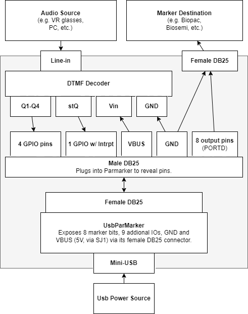

# Tone Marker
Device that uses sound tones to send markers.

## Purpose
The purpose of the "Tone Marker" device is to translate spacial tones into TTL markers. The tones can be embedded into any system with an audio output (e.g. VR games, websites, cellphones), and allow those devices to send custom markers (all 256 values). This functionality is necessary for syncing recorded data (e.g. BIOPAC) with VR experiences, where hardware control is not possible. The current method of simply recording the sound does not work well, and requires considerable manual labor.

## Communication protocol

The device expects DTMF markers to start with a `*` and end with a `#`. Markers in the range of 0 to 255 can be produced. This means DTMF markers should be of the form `*55#` for, for example, a marker with value 55. Sending a marker of 256 (255 + 1) will send a marker of value 1 for 100ms, after which the device will reset to 0. The default markers (for example `*1#`) will remain at their specified value until another value is provided.

## Private Dev Log
_This is the private dev log section. It will be deleted, and the branch squash-merged to main and deleted before the repo goes public. So log anything you want. As a test, let's try using an actual log (see notes/log.md)._

## Implementation 1 (Voice-Band DTMF):
This project builds a device that decodes DTMF tones transferred to it via an analog audio line, and sends out corresponding digital markers. It uses a MT8870 DTMF decoder and a modified UsbParMarker.

### Device
Use a DTMF [decoder](https://www.tinytronics.nl/en/sensors/sound/mt8870-dtmf-module) to decode the sound, and send the data to a UsbParMarker. The UsbParMarker's DB25 connector has both inputs and outputs, but only the outputs are usually used. To access the input and isolate them from the output, use a blank male DB25 with solder cups (or ribbon cable DB25), then connect the DTMF decoder to the required pins, and the marker pins to a separate female DB25 connector. See usbParMarker schematic in docs folder. Note, to enable the VBUS out, the SJ1 jumper pad needs to be setup correctly.

More info about Arduino and DTMF [here](https://www.youtube.com/watch?v=Wx6C4k_xxz0). 

The device will be enclosed in a 3D printed enclosure, with three ports: a female DB25 for sending markers, a 3.5 mm jack for sound input, and a Mini-USB for power.

Overview of the Tone-Marker device. Grey area denotes the device.

### Protocol
Devise a communication protocol. Consider always sending 5 characters: a start character, three data characters, and an end character (e.g.: *123#). The characters denote the marker number (0 - 255). These markers are then set by the device and held until a new marker is sent. To have the device send a 100 ms marker pulse, send the marker value plus 255; e.g. *256# sends a marker with value 1 for 100 ms. Note that a zero pulse cannot be sent. This allows for easier generation of the tones compared to encoding the marker value in the three nibbles.

### Tone Generator and Testing 
Make a website that generates the tones (or just [use this one](https://onlinesound.net/dtmf-generator)). Test the device by donning VR glasses, connecting it to the tone-marker device, using the VR browser to go to the tone website, and playing a tone sequence. 

Once a simple proof of concept has been built and tested, and the use-case shown, a more refined device can be created (perhaps with a custom PCB). 

## FUTURE: Implementation 2 (Inaudible Markers)
Use the Teensy 4 and its sound board to receive audio from a source, filter out the marker-tones, and feed it back to the participant. Consider using a low-pass filter (e.g. at 14 kHz) and keeping the marker tones above that frequency. Use [this](https://www.pjrc.com/teensy/gui/#) to design the filtering and tone detection.
