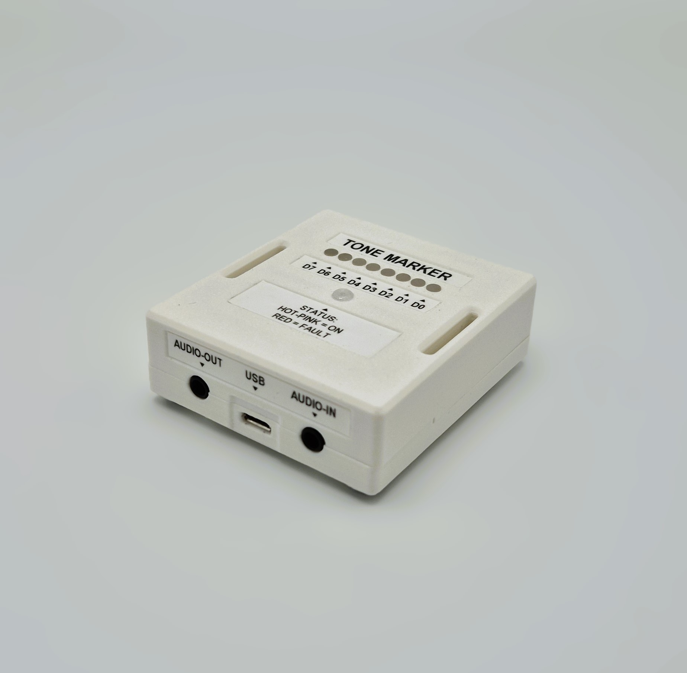
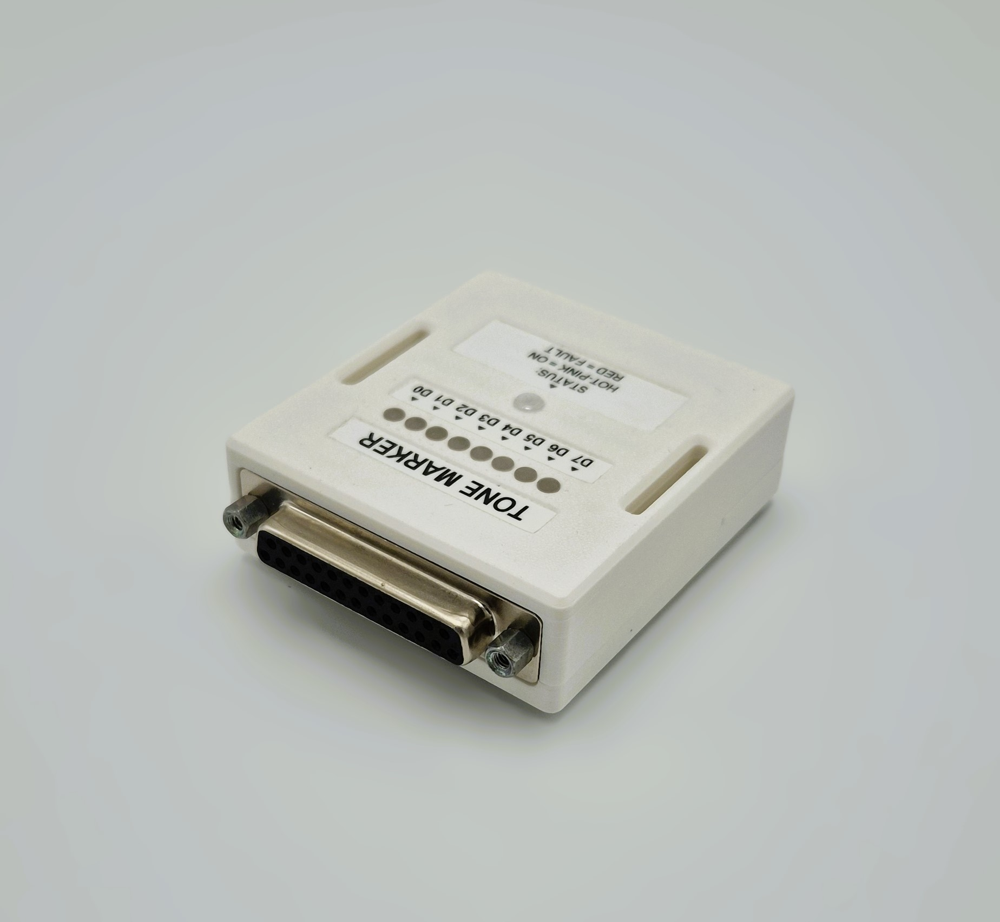

# Tone Marker

## Introduction
The purpose of the "Tone Marker" device is to translate high-frequency tones ($\ge$ 15 kHz) into Transistor-transistor Logic (TTL) markers. This allows any application with an audio output (e.g. virtual reality games, websites, cellphones) to send custom markers (values ranging from 0 up to 255) by embedding these marker tones in the audio output.

Sending markers is necessary for synchronization of recorded data (e.g. BIOPAC measurements) with VR experiences, where hardware control is not possible. Marker tones are chosen in such a way that they are inaudible for the participant (through audio filtering).

## Usage

### Setup
The Tone Marker device consists of a [Teensy 4.0](https://www.pjrc.com/store/teensy40.html) soldered to a custom PCB, which is based on the [Teensy Audio Shield](https://www.pjrc.com/store/teensy3_audio.html).
Power is provided through a Mini-USB connection to a dedicated power source (such as a powerbank). The audio input (from e.g. the VR glasses) is fed into the tone-marker, while simultaneously being fed directly into the marker destination (as a backup). Marker output is done through a Female DB25 connector, which is then connected to the required data recording device (e.g. BIOPAC, BIOSEMI).

An overview of the internal and external connections is shown below.

> **NOTE**: Do not disconnect the Tone Marker device from power while it is still connected to a powered marker destination (e.g. a BIOPAC that is turned on). This may cause the Tone Marker device to enter a state where it attempts to power itself by drawing power from the marker destination, which may cause damage to the Teensy or the marker destination device. In this undesired state, the Tone Marker device's status LED may glow red instead of hot-pink.

### Communication protocol

The device expects tones (or combinations of tones) of specific frequencies. The device is currently uses an encoding system with a signal line and two data lines. The signal line makes the device enter listening mode. In listening mode the device receives a bitstring by interpreting the other two frequencies as either 0's (LOW) or 1's (high).

Frequencies are detected by the Goertzel algorithm, and are therefore optimized for their respective Goertzel bin. This is done for the Goertzel algorithm using 150 clock cycles and a sampling frequency of 44100, resulting in the following frequencies:

- **Signal frequency**: 15288.0 Hz
- **Data LOW frequency**: 15582.0 Hz
- **Data HIGH frequency**: 15876.0 Hz

Soundfiles for marker values under this encoding can be found in this repository (in the `media` directory). This directory also contains a movie file (`marker-testing.mp4`) that can be used to test marker accuracy in your setup. Custom test movies can be made by running `software/python/video-generation.py`.

Overall, usage of the `.wav` files is recommended, since they are less compressed than the `.mp3` files.

## Known Issues

### Transient Marker Values
It was noticed that when measuring the marker outputs at 25 kHz using a BIOPAC, approximately 24 of 344 markers showed intermediate values when setting all bits to their ON state (255). When measuring at 2 kHz, the same problem occurred only once (1 / 344). In all cases, the intermediate values had a duration of only a single sample.

As such, it is vitally important to find and remove any such intermediate values before analyzing the data. Please not that the [PhysioData Toolbox](https://physiodatatoolbox.leidenuniv.nl/) automatically corrects for this by removing single-sample markers.

Note, it was not ruled out that this issue was (partly) caused by the BIOPAC's possibly non-simultaneous sampling of the digital input ports.

### Single-Register Patch
The current design spreads the marker IO pins across multiple port registers on the Teensy. A possible fix would be to redesigned the PCB in such a way that it makes use of a single port register, allowing faster bit setting. This may be accomplished using the pins mentioned below, since they are not used by the teensy audio shield, and can all be controlled by changing the GPIO6 register.

| Pin number 	| GPIO6 register index 	|
|------------	|----------------------	|
| 01         	| 02                   	|
| 00         	| 03                   	|
| 24         	| 12                   	|
| 14         	| 18                   	|
| 17         	| 22                   	|
| 16         	| 23                   	|
| 22         	| 24                   	|
| 26         	| 30                   	|

This single-register design was tested and still resulted in 2 out of 360 marker having intermediate values when measured using a BIOPAC at 25 kHz.

### Power supply
Currently, the device enters an undefined state while being connected to the powered BIOPAC without being powered by the micro-USB connector. This is due to the BIOPAC's pull-up resistors and could possibly damage the Teensy. Having the Tone Marker device off and connected to a powered BIOPAC should always be avoided.

## Notes

### Power supply

Some USB power adapters have some noise, which is then audible in the audio signal. In order to avoid this, the usage of a powerbank for powering the Tone Marker device is recommended.

### Volume

Different values of input audio volume might affect Tone Marker performance in different ways. The currently recommended volume level is 65% (on a windows PC) or 80% (on VR glasses).

Furthermore, VR glasses seem to have a lower volume output, so heightening the gain of the marker soundfiles is recommended. Marker functionality can be monitored by checking the green LEDs.

### Additional information / sources

- [Information on the Teensy 4.0 audioshield](https://forum.pjrc.com/index.php?threads/available-teensy-4-0-pins-when-audio-shield-d-attached.58331/)
- [Information on available Teensy pins while the audioshield is connected (and register mappings)](https://github.com/luni64/TeensyTimerTool/wiki/Avoid-PWM-timer-clashes)
- [Teensy pin-register forum thread](https://forum.pjrc.com/index.php?threads/teensy-4-1-digital-i-o-pin-map.64226/)
- [Using Teensy GPIO registers](https://forum.pjrc.com/index.php?threads/tutorial-on-digital-i-o-atmega-pin-port-ddr-d-b-registers-vs-arm-gpio_pdir-_pdor.17532/)
- [DigitalRead, DigitalWrite, DigitalWriteFast speeds](https://forum.pjrc.com/index.php?threads/speed-of-digitalread-and-digitalwrite-with-teensy3-0.24573/)
- [Additional explanation on registers](https://forum.pjrc.com/index.php?threads/unclear-on-how-to-use-ddrx-and-portx-teensy-3-2.53950/)
- [Goertzel Algorithm](https://courses.cs.washington.edu/courses/cse466/11au/resources/GoertzelAlgorithmEETimes.pdf)
- [Changing soundfile audio volume in python](https://stackoverflow.com/questions/43679631/python-how-to-change-audio-volume)
