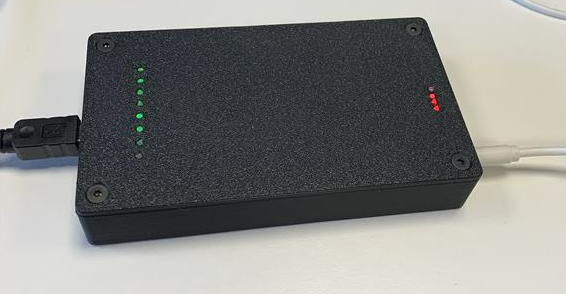
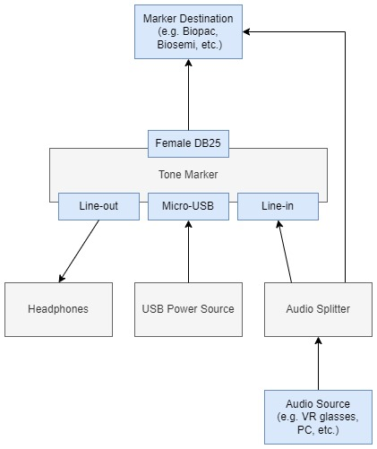

# Tone Markers

<!--   TODO -->

## Device purpose

The purpose of the "Tone Marker" device is to translate high-frequency tones ($\ge$ 15KHz) into Transistor-transistor Logic (TTL) markers. This allows any application with an audio output (e.g. virtual reality games, websites, cellphones) to send custom markers (values ranging from 0 up to 255) by embedding these marker tones in the audio output.

Sending markers is necessary for synchronization of recorded data (e.g. BIOPAC measurements) with VR experiences, where hardware control is not possible.

## Usage

### Setup

Internally, the Tone Marker device consists of a Teesy 4.0 ([Teensy 4.0](https://www.pjrc.com/store/teensy40.html)) and a custom made PCB audioboard.
Power is provided through a Mini-USB connection to a dedicated power source (such as a powerbank). The audio input (from e.g. the VR glasses) is fed into the tone-marker, while simultaneously being fed directly into the marker destination (for quality control). Marker output is done through a Female DB25 connector, which is then connected to the required data recording device (e.g. BIOPAC, BIOSEMI).

An overview of the internal and external connections is shown below.

### Communication protocol

The device expects tones (or combinations of tones) of specific frequencies. The device is currently uses an encoding system with a signal line and two data lines. The signal line makes the device enter listening mode. In listening mode the device receives a bitstring by interpreting the other two frequencies as either 0's (LOW) or 1's (high).

Frequencies are detected by the goertzel algorithm, and are therefore optimized for their respective goertzel bin. This is done for the goertzel algorithm using 150 clock cycles and a sampling frequency of 44100, resulting in the following frequencies:

- **Signal frequency**: 15288.0 Hz
- **Data LOW frequency**: 15582.0 Hz
- **Data HIGH frequency**: 15876.0 Hz

Soundfiles for marker values under this encoding can be found in this repository (in the `media` directory). This directory also contains a movie file (`marker-testing.mp4`) that can be used to test marker accuracy in your setup. Custom test movies can be made by running `software/python/video-generation.py`.

Overall, usage of the `.wav` files is recommended, since they are less compressed than the `.mp3` files.

## Notes

### Power supply

Some USB power adapters have some noise, which is then audible in the audio signal. In order to avoid this, the usage of a powerbank for powering the Tone Marker device is recommended.

### Volume

Different values of input audio volume might affect Tone Marker performance in different ways. The currently recommended volume level is 65% (on a windows PC) or 80% (on VR glasses).

Furthermore, VR glasses seem to have a lower volume output, so heightening the gain of the marker soundfiles is recommended. Marker functionality can be monitored by checking the green LEDs.

### Additional information / sources

- [Information on the Teensy 4.0 audioshield](https://forum.pjrc.com/index.php?threads/available-teensy-4-0-pins-when-audio-shield-d-attached.58331/)
- [Information on available Teensy pins while the audioshield is connected](https://github.com/luni64/TeensyTimerTool/wiki/Avoid-PWM-timer-clashes)
- [Teensy pin-register mapping](https://forum.pjrc.com/index.php?threads/teensy-4-1-digital-i-o-pin-map.64226/)
- [Using Teensy GPIO registers](https://forum.pjrc.com/index.php?threads/tutorial-on-digital-i-o-atmega-pin-port-ddr-d-b-registers-vs-arm-gpio_pdir-_pdor.17532/)
- [DigitalRead, DigitalWrite, DigitalWriteFast speeds](https://forum.pjrc.com/index.php?threads/speed-of-digitalread-and-digitalwrite-with-teensy3-0.24573/)
- [Additional explanation on registers](https://forum.pjrc.com/index.php?threads/unclear-on-how-to-use-ddrx-and-portx-teensy-3-2.53950/)
- [Goertzel Algorithm](https://courses.cs.washington.edu/courses/cse466/11au/resources/GoertzelAlgorithmEETimes.pdf)
- [Changing soundfile audio volume in python](https://stackoverflow.com/questions/43679631/python-how-to-change-audio-volume)
